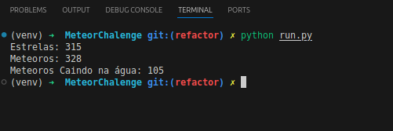

# Desafio proposto pela empresa "Tarken"

# MeteorChalleng

**Tasks:**
- Count the number of Stars
- Count the number of Meteors
- If the Meteors are falling perpendicularly to the Ground(Water level), count how many will fall on the Water
- (optional) Find the phrase that is hidden in the dots in the sky.

- **Hint 1**: 175 Characters 
- **Hint 2**: Most of the last task's code can be reused for this one. 

**[Sample] Answers**:

- Number of Stars:
- Number of Meteors:
- Meteors falling on the Water
- (optional) Hidden Phrase

**Pixel Ref**:
- (Pure white) Stars
- (Pure red) Meteors
- (Pure blue) Water
- (Pure black) Ground


## Comandos de instalação
- *Certifique que tenha o Python 3.12.3 instalado no seu sistema*:
    ```bash
    python --version
    ```
- *Caso não tenha o Python instalado*:
    ```bash
    sudo apt install python3.12 -y
    ```
- *Clone o repositório*:
    ```bash
    git clone https://github.com/thiagoluznascimento/MeteorChalleng.git
    ```

## Para utilizar o projeto

- *Ative o ambiente virtual Linux*:
   ```bash
    source venv/bin/activate
- *Ative o ambiente virtual caso utilize o windows*:
    ```bash 
    venv\Scripts\Activate
    ```
- *Instale as dependências*:
  ```bash
  pip install -r requirements.txt
  ```
- *Caso queira, rode o flake8*:
    ```bash 
    flake8 src/main.py
    ```
- *Para rodar o projeto*:
    ```bash
    python run.py
    ```
- *Para rodar o projeto pelo script meteor*:
    ```bash
    python meteor.py
    ```
 

## Explicação dos resultados:

Para dar início ao projeto, pesquisei bibliotecas do Python para manipulação de imagens e identifiquei que a mais utilizada atualmente é a biblioteca **Pillow(PIL)**. Com ela, é possível carregar, ler e manipular cada pixel de uma imagem. O canal do YouTube **Programação dinâmica** me ajudou bastante a entender melhor o funcionamento dessa biblioteca. Aqui está a playlist em que o Professor Hallison Paz explica muito bem como funciona o processamento de imagens com a linguagem Python: [Playlist](https://encurtador.com.br/HwX32). Nessa playlist, ele também aborda o esquema de cores RGB e RGBA, o que foi essencial para o desenvolvimento deste projeto.

Outras fontes estudadas incluem: [Documentação pillow](https://pillow.readthedocs.io/en/stable/handbook/tutorial.html),  [Serprogramador](https://serprogramador.com.br/artigos/topico/css/Como-entender-os-padroes-de-cores-RGB-RGBA-Hexadecimal), [Wikipedia RGBA](https://pt.wikipedia.org/wiki/RGBA), [Wikipedia RGB](https://pt.wikipedia.org/wiki/RGB), [ChatGPT](https://chatgpt.com/), [kaspersky](https://www.kaspersky.com.br/blog/digital-steganography/12132/).

Para identificar as estrelas, meteoros, água e o solo, foram definidos valores padrão RGB para cada cor fornecida no desafio, da seguinte forma:

    WHITE = (255, 255, 255) # Estrelas
    RED = (255, 0, 0)  # Meteoros
    BLUE = (0, 0, 255) # Água
    BLACK = (0, 0, 0) # Solo

Para contar o número de estrelas, meteoros e meteoros que caem na água, foram criadas variáveis de contagem, inicializadas com o valor 0:

    star_count = 0
    meteor_count = 0
    water_meteors = 0

Para contabilizar as estrelas e meteoros, foi criado um laço `for` que percorre cada pixel na horizontal (width) e, dentro dele, outro laço `for` que percorre cada pixel na vertical (height) da imagem. Em seguida, o código compara se o pixel é da cor `WHITE` (branco); se sim, incrementa +1 na variável `star_count`. Caso contrário, se o pixel for `RED` (vermelho), incrementa `+1` na variável `meteor_count`.

Para identificar os meteoros que caem na água, foi criado um laço `for` que percorre cada linha e coluna de pixels da imagem. Inicialmente, a variável `meteor_in_column` é definida como `False`. O código então compara se o `pixel == RED`; se sim, `meteor_in_column` recebe `True`, indicando que há um meteoro na coluna. Em seguida, verifica se o `pixel == BLUE` e `meteor_in_column` é `True`; nesse caso, `water_meteors` é incrementada em `+1`, contabilizando os meteoros que caem na água. Por fim, se o `pixel == BLACK`, o laço é interrompido `break`,  pois encontrou o solo.

### Observações:
- O script `meteor.py` foi refatorado para o conceito de programação orientada a objetos (POO);

Ainda estou buscando decifrar a mensagem oculta, mas, até o momento, sem sucesso. Tentei utilizar a biblioteca `stegano` para verificar se havia algum tipo de esteganografia, mas aparentemente não é o caso. Outra possibilidade que considerei foi a presença de um código morse, já que ele utiliza uma "linguagem" de pontos, porém, essa análise também não me revelou nada. Vou continuar explorando outras abordagens para tentar decifrar o enigma.
### outros
- SO utilizado: `Ubuntu 24.04.`.